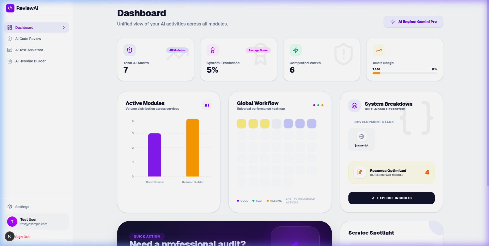
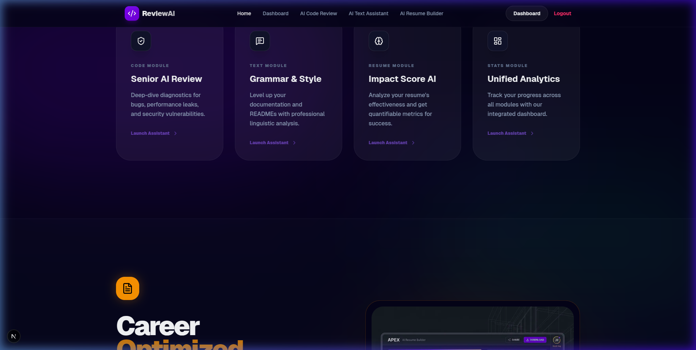
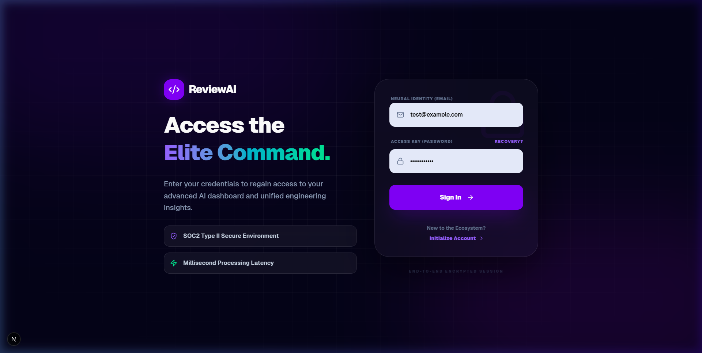
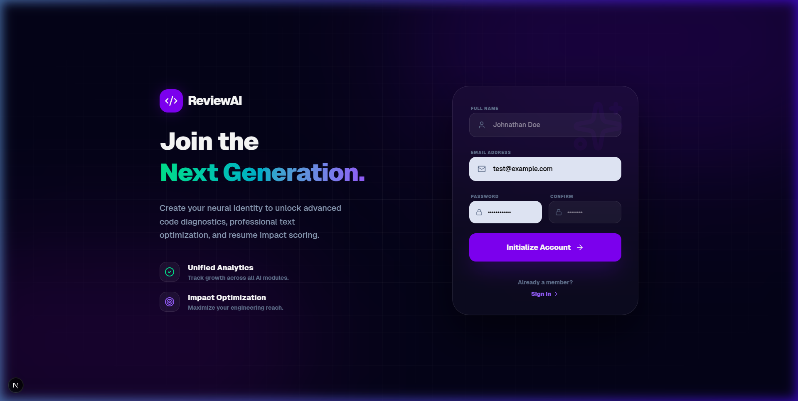
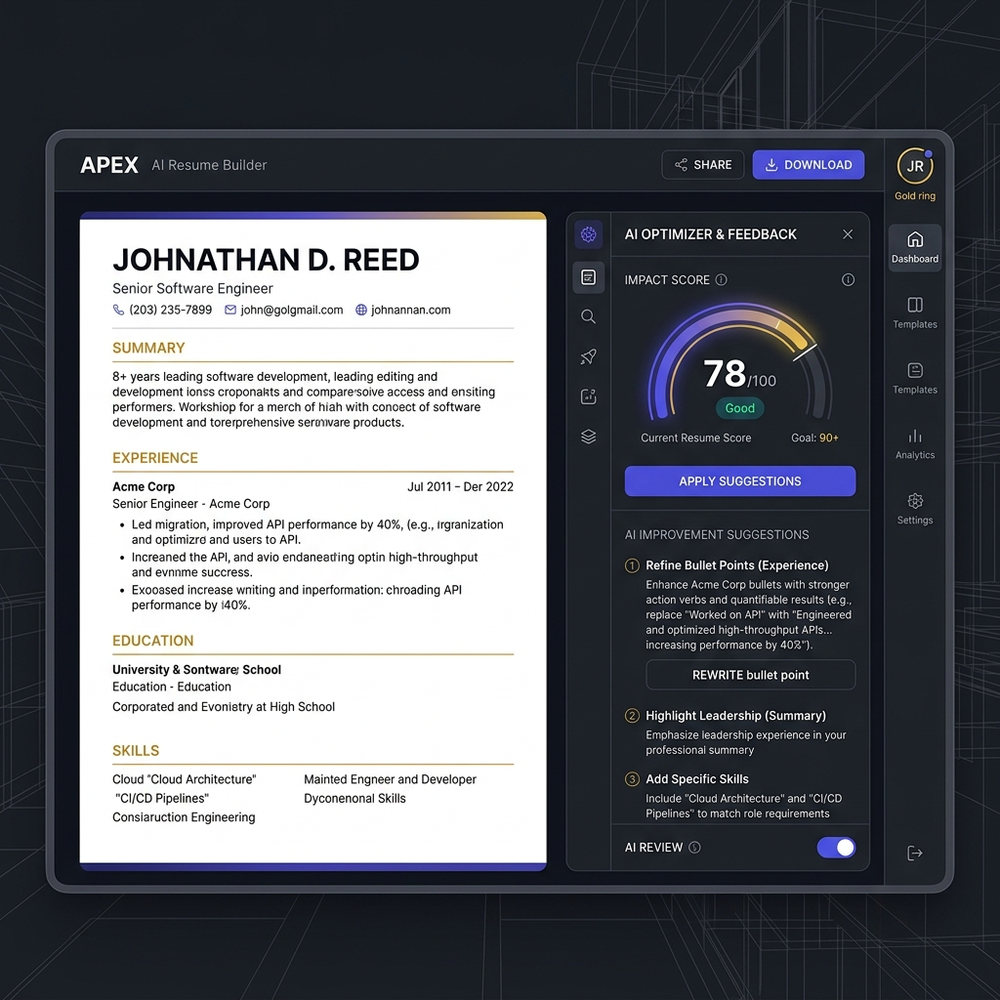

# ReviewAI - The Ultimate AI-Powered Engineering Suite

ReviewAI is a high-performance platform designed to elevate code quality, streamline professional communication, and optimize career assets using advanced Artificial Intelligence.

## 🌟 Premium Interface

### Unified Analytics Dashboard
Our modernized dashboard provides a 360-degree view of your AI activities across Code, Text, and Resumes.


### Advanced Home Experience
A sophisticated "Neural Mesh" interface designed for high-level engineering teams.


### Elite Authentication
State-of-the-art authentication flow with layered glassmorphism and neural backgrounds.
| Login Experience | Registration Portal |
| :--- | :--- |
|  |  |

## 🚀 Core Modules

### 1. AI Code Review
Deep-dive diagnostics for bugs, performance leaks, and security vulnerabilities. Get expert-level analysis and one-click refactoring suggestions.

### 2. AI Text Assistant
Linguistic processing for documentation, READMEs, and professional communication. Fix grammar, adjust tone, and summarize long logs instantly.

### 3. AI Resume Builder
Generate impact-optimized resumes with AI scoring, industry-standard templates, and one-click PDF generation.


## 📊 Analytics Deep-Dive
- **Expertise Stack**: Visualizes your most reviewed programming languages and writing modes.
- **Activity Distribution**: Tracks audit volume across Code, Text, and Resume modules.
- **Universal Workflow Heatmap**: A color-coded history grid showing your performance and activity trends over time.

## 🛠️ Tech Stack
- **Frontend**: Next.js 16 (App Router), TypeScript, Tailwind CSS
- **Visualization**: Recharts
- **Icons**: Lucide React
- **Backend**: Laravel API

## Getting Started

1. Clone the repository
2. Install dependencies:
   ```bash
   npm install
   ```
3. Run the development server:
   ```bash
   npm run dev
   ```
4. Configure environment variables in `.env.local`:
   ```env
   NEXT_PUBLIC_API_URL=http://localhost:8000/api
   ```

---
Built with ❤️ for modern engineering teams.
